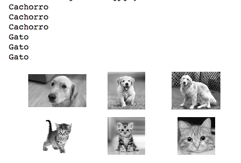

# CNN - Convolutional Neural Network
## Rede Neural Convolucional
**Cleuton Sampaio**

É uma rede neural dupla, sendo que a primeira parte é dedicada a capturar as características de cada imagem, enquanto a segunda, classifica essa característica de acordo com os pesos.

## Convolução

Convolução é o processo de adicionar cada elemento da imagem aos seus vizinhos locais, compensado por um núcleo ou Kernel. O kernel ou matriz de convolução, ou ainda "máscara", é uma pequena matriz, que determina o que deve ser ser multiplicado e adicionado a cada pixel, gerando uma imagem menor. 

É utilizada em operações de sharpening, blurring, embossing, detecção de bordas e outras operações em imagens.


([*crédito*](http://machinelearninguru.com/computer_vision/basics/convolution/image_convolution_1.html))


O kernel é rotacionado sobre todos os pixes da imagem original, gerando uma matriz resumida, onde cada ponto é um resumo das operações de multiplicação de cada elemento do kernel.

## Pooling

Pooling é o processo de reduzir a dimensionalidade das características, reduzindo o tamanho da entrada. Além de tornar o processamento mais simples e rápido, evita o **overfitting**.

Utilizamos uma matriz de pooling para sumarizar os pontos da imagem convolucionada. Podemos sumarizar pegando o maior valor de um grupo de pontos (MAX) ou a sua média (AVERAGE).


([*crédito*](https://ujjwalkarn.me/2016/08/11/intuitive-explanation-convnets/))

## Camadas de uma rede convolucional

Geralmente, temos um núcleo convolucional, formado por 3 camadas, que pode se repetir em uma CNN, antes de passar para a segunda parte, que é a classificação: 

1. **Convolução**;
2. **Retificação** (adicionar não-linearidade);
3. **Pooling**.

A **retificação** elimina os pontos negativos na imagem, substituindo-os por zero. Ela pode ser feita utilizando qualquer uma das funções de ativação mais comuns, como: **ReLU**, **sigmoid** ou **tanh**.

Geralmente, uma CNN é a união de duas Redes Neurais: uma Convolucional, e outra Classificatória, como na imagem: 


([*crédito*](https://ujjwalkarn.me/2016/08/11/intuitive-explanation-convnets/))

## Implementação

Neste exemplo, de gatos e cachorros, utilizamos o dataset cats & dogs, do Kaggle, para implementar uma CNN bem simples. 

Você pode visualizar o [**notebook jupyter**](./DogsCats.ipynb) e acompanhar a imeplentação da CNN.

[Baixe os arquivos](https://www.kaggle.com/c/dogs-vs-cats) e descompacte conforme as variáveis dir_treino e dir_teste. Coloque labels em pelo menos 30 imagens de teste, para poder validar (é só renomear os arquivos como os de treino).

Neste exemplo, utilizamos o [**Keras**](https://keras.io) como frontend para o [**TensorFlow**](https://www.tensorflow.org), mas é possível criar CNNs com outros pacotes, como o [**MXNET**](https://mxnet.apache.org) ou o [**PyTorch**](https://pytorch.org).

Criamos uma função para adicionar camadas convolucionais: 
```
def conv3x3(input_x,nb_filters):
    # Prepara a camada convolucional
    return Conv2D(nb_filters, kernel_size=(3,3), use_bias=False,
               activation='relu', padding="same")(input_x)
```
E a utilizamos para montar as camadas de nossa CNN: 
```
# Cria o modelo executando um treino e avaliação:
inputs = Input(shape=(img_h, img_w, 1))
x = conv3x3(inputs, 32)
x = conv3x3(x, 32)
x = MaxPooling2D(pool_size=(2,2))(x) 
x = conv3x3(x, 64)
x = conv3x3(x, 64)
x = MaxPooling2D(pool_size=(2,2))(x) 
x = conv3x3(x, 128)
x = MaxPooling2D(pool_size=(2,2))(x) 
x = Flatten()(x)
x = Dense(128, activation="relu")(x)
```
Ao final do último **pooling** eu "achatei" as dimensões, e depois criei uma camada densamente conectada.

## O Resultado

Eu consegui uma boa acurácia e testei com imagens colhidas do Google, sem fazerem parte dos datasets de treino e teste:



Se quiser saber mais sobre estas técnicas, leia os meus livros (em Python ou R): 

