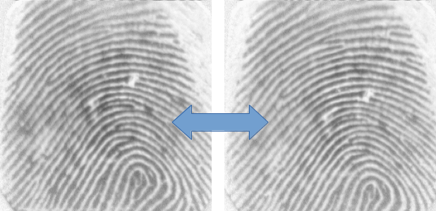
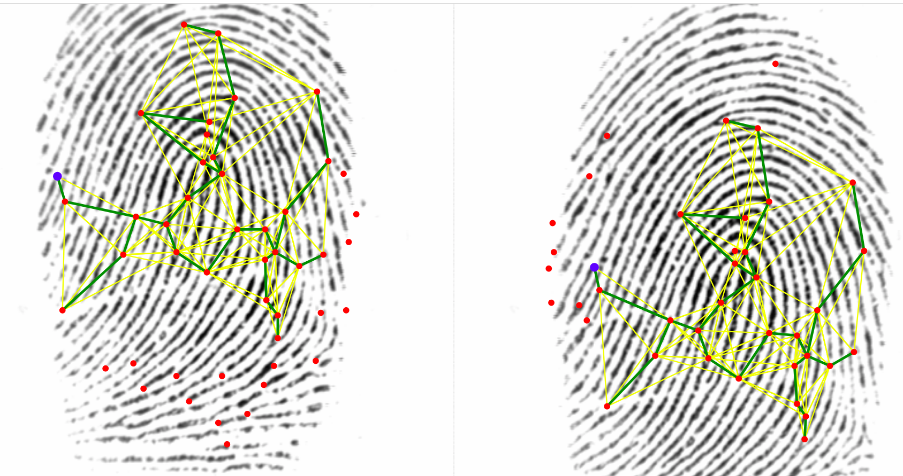

# FingerPrint Comparator
## Cleuton Sampaio



Este código é baseado no projeto [**SourceAFIs**](https://github.com/robertvazan/sourceafis-java).

É só rodar o comando abaixo para criar um Jar: 

```
mvn clean package
```

Rode a classe principal, informando dois argumentos: 

1. O caminho da imagem principal (101_5.tif);
2. O caminho da imagem secundária (101_8.tif);

Ele vai mostrar o **score** da comparação das duas digitais e vai dizer se há um **match** entre elas. 

O algoritmo [**SourceAFIS**](https://sourceafis.machinezoo.com/algorithm) detecta algumas *minúcias* da impressão digital, como: fins de linhas e início de duplicações, depois comparar esses mesmos pontos entre duas imagens diferentes, indicando o percentual de comparação.



Você pode usar o algoritmo para comparar a digital de um documento, como a Identidade, com a digital capturada em um dispositivo biométrico, por exemplo.

É até possível comparar fotos de digitais, mas elas devem ser muito precisas, feitas com lentes macro. A melhor solução é digitalizar a biometria com um sensor (são muito baratos) e escanear um documento que tenha a digital (normalmente, polegar direito).

Eu usei o [**um banco de digitais freeware**](http://bias.csr.unibo.it/fvc2000/download.asp) com resultados muito bons.
