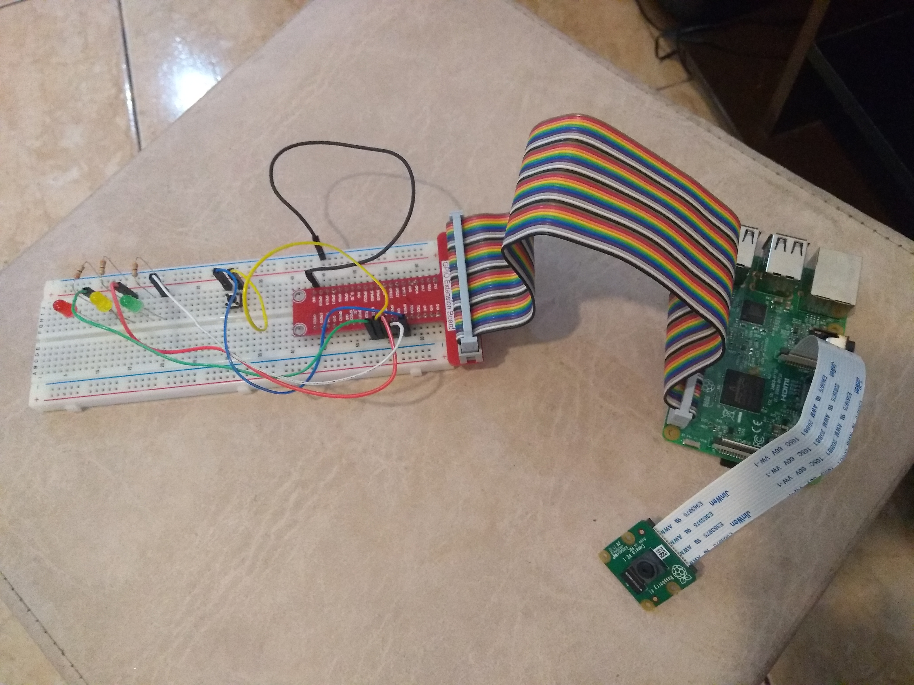
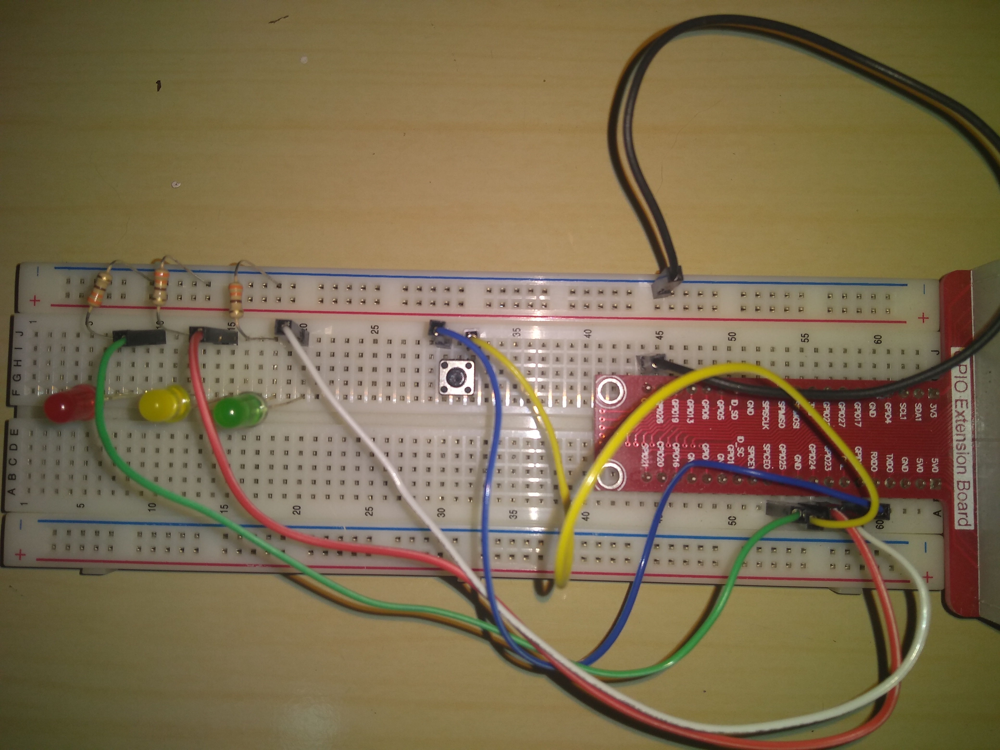
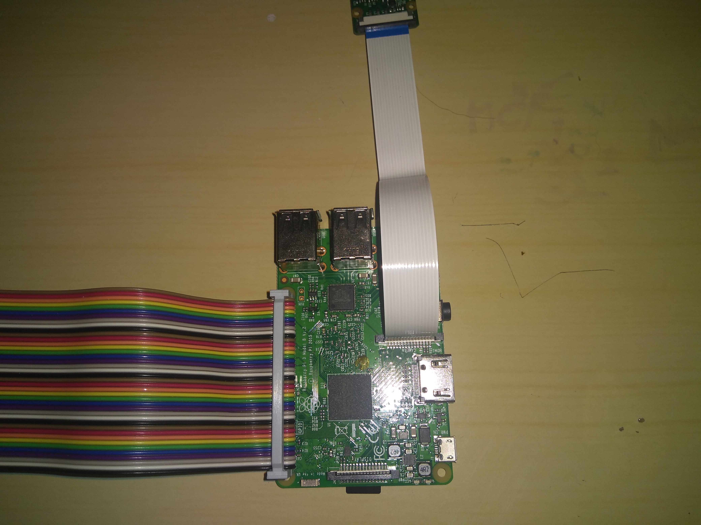

# OLHAR COMPUTACIONAL
[**Cleuton Sampaio**](https://github.com/cleuton)

Bem vindo ao meu site de estudos sobre **visão computacional** e suas aplicações. Aqui, tudo é open source. 

Welcome to my **computer vision** research site. Everything here is open source.

[](http://www.lcm.com.br/site/#livros/detalhesLivro/data-science-para-profissionais---utilizando-r.html)

[](http://datalearninghub.com)
[](http://iotreta.com)

## CNN demo with dogs & cats

A CNN implementation which can recognize dogs and cats image. 
[**CNN**](./CNN)

## Simple Face Detection and Recognition for webcams

A simple face detection program with a face recognition CNN for use in web and security cams: 
[**Face Detection and Recognition**](./FaceRec)

## FaceGuard - Face recognition + Machine Learning + IoT Demo

[**TEXTO EM PORTUGUÊS AQUI!!!**](http://www.obomprogramador.com/2018/02/tutorial-de-machine-learning-iot.html)

[**VIDEO**](https://youtu.be/sqkxT7MBa8U)

Most of the source code in this demo is a derivative from [**David Sandberg's** work](https://github.com/davidsandberg). The original license is included as file [**ORIGINAL_LICENSE.md**](./ORIGINAL_LICENSE.md).

The source code added by this work is composed of files: 
- [**photoserver.py**](./facenetmaster/src/photoserver.py): Photo server app, which receives a Photo and uses the Classifier to get a match;
- [**Foto.py**](./facenetmaster/src/Foto.py): Auxiliary class for the Photo server;
- [**photoclient.py**](./FaceNet/photoclient.py): Raspberry client, which captures a photo and sends it to the server.

All of the added source code is licensed using Apache 2.0 (included in the project).

## Description 

This is an implementation of FaceNet using IoT for face recognition. Using a Raspberry PI 3, with a Raspberry camera, a person "shoots" a photo, which will be sent to a remote server for processing. The remote server aligns and loads it into a Classifier to get a match. If it matches more than 60%, then a positive result is sent back to Raspberry PI.

## Setup

First, you'll need to create a Python virtual environment for you, using *Anaconda*! [**Install Anaconda**](https://www.anaconda.com) and run the following command: 

```
conda env create -f ds-env.yml
```

The file [**ds-env.yml**](./ds-env.yml) is in the main repository folder. Any time you want to run this tutorial, activate the environment: "source activate facenet" (for Linux and MacOS) or "activate facenet" (for MS Windows).

You'll need to train a Classifier using [*LFW public dataset*](https://github.com/davidsandberg/facenet/wiki/Validate-on-LFW). 

You can then train again using [*your own photos*](https://github.com/davidsandberg/facenet/wiki/Train-a-classifier-on-own-images). After that, you can run the [*photoserver*](./facenetmaster/src/photoserver.py) and install and run the [*photoclient*](./FaceNet/photoclient.py) on your **Raspberry PI 3**.

## Raspberry PI circuit

The Raspberry remote device has a camera, a button and 3 leds: Yellow, Red, and Green.




You point the camera at yourself (or other person), press the switch, the yellow Led lights up and your photo is taken and sent to the RESTfull server. The server aligns and process your photo, returning HTTP Status 200, if it recognizes you (60% match), or 404, if it doesn't recognize you.

The materials list is:
1) One Raspberry PI 3;
2) A protoboard;
3) A Raspberry protoboard connector and flat cable (the long parallel multi color cable);
4) 3 leds: Yellow, Green, and Red;
5) 3 330 Ohms resistors;
6) Some jumper wires of different colors;
7) A switch (button);
8) A Raspberry camera.

You can find these materials on any good online store, like Sparkfun or MercadoLivre (Brazil).

Assemble the protoboard circuit: 



Plug the Raspberry connector into the protoboard like the picture. Leave the groove exactly in the middle of the connector. It has labels for Raspberry's sockets: GPIOs, GND (ground), Voltage (3.3 or 5 v).

Plug the other side into Raspberry's connector. Pay attention to the right side. If you are unsure, get a Multimeter and check the voltages. According to the picture, the first upper left connection is 3.3v and the bottom left is 5v, measure them. 

Ok, now, plug the switch exacly like the picture. The switch has four legs, linked two by two. If you press the button, it will short circuit all of them. Pay attention because it's more tricky than it looks like. Read [**this article:**](https://www.hackster.io/hardikrathod/push-button-with-raspberry-pi-6b6928)

Remember to attach a jumper cable to one side of the switch and to one GPIO socket. I used GPIO 18. If you connect to a different socket, then you'll need to change photoclient's code. The other side must be connected to a GND socket (any).

Finally, plug the 3 leds. A led has two legs, one longer and the other shorter. The longer leg is called "anode" and it's connected to the power line or, in our case, the GPIO of your choice. The shorter leg is called "cathode" and it's connected to the ground (GND).

**Resistors**

We have to protect the Raspberry and the Led from pulling out too much energy. Therefore we connect a 330 Ohm resistor between the GND and the shorter leg of each led, like the picture.

The protoboard has horizontal and vertical circuits. There are two horizontal bands at each end, one market positive (red) and other negative (blue). You can wire a cable between the negative band and any GND socket of the Raspberry. Then, plug one leg of each 330 Ohm resitor into this line.

The other resitor leg must be connected to a vertical circuit, after the red line, exactly like the picture. 

Each led must have its longer leg connected (using a jumper cable) to a GPIO socket. I used these sockets (pay attention! If you use different sockets, you'll need to change photoclient's code): 
- Yellow led: GPIO 23
- Red led: GPIO 25
- Green led: GPIO 24

**Raspberry side**



Pay attention to the connection socket for the flat cable. It must be in the right position, otherwise you may damage your Raspberry. Use a multimeter, like I told before, and check in the protoboard for 3.3 and 5 v. 

The camera must be connected to the slot near the HDMI outlet. It has a conector side and a blind side. Be sure to plug in the right position. See [**this article**](https://projects.raspberrypi.org/en/projects/getting-started-with-picamera).

The camera has a fixed positio, so you must rotate it to see what is the up side. Be sure to run [**raspi-config**](https://www.raspberrypi.org/documentation/usage/camera/python/README.md) to enable the camera. 


